<h1 align="center">👋 𝑯𝒊, 𝑰'𝒎 𝒎𝒓𝑺𝒂𝒔𝒉𝒂𝒎𝒂𝒏</h1>
<h3 align="center">Dev • Unity • C# • Python • JavaScript • Exiled</h3>

  

---
## :basecamp: About Me
:shipit: Dev, gamer and cool dude.

---

## :accessibility: Tech & Tools

  
  
  
  
  
  
  
  
  
  
  
  
  
  
  

---

## 📊 GitHub Stats

  

  
  

---

## 🎮 My Published Games

  

  

  

---

## :dependabot: Find Me Here

---

:octocat: Writing code.
